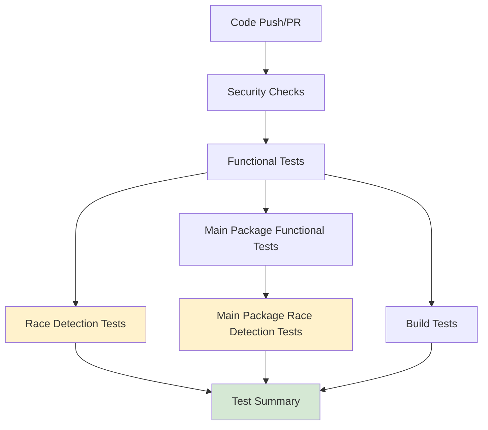

<!--
SPDX-License-Identifier: Apache-2.0
SPDX-FileCopyrightText: 2025 The Linux Foundation
-->

# Race Condition Testing Strategy

This document outlines the comprehensive race condition testing strategy for the 1Password Secrets Action project.

## Overview

Race conditions are a critical concern in concurrent Go applications. This project implements a two-stage testing
approach that separates functional correctness from race condition detection, ensuring that CI workflows remain
stable while providing comprehensive concurrency safety analysis.

## Problem Statement

### Previous Issues

- **CI Failures**: Tests were failing in GitHub Actions due to race detector findings, even when functional
  logic was correct
- **Limited Visibility**: Race detector output was truncated in CI logs, making debugging difficult
- **Workflow Blocking**: Race conditions caused complete CI failure, blocking development progress
- **Mixed Concerns**: Functional tests and race detection were coupled, making it hard to distinguish between
  logic errors and concurrency issues

### Current Approach

The new strategy implements:

1. **Separation of Concerns**: Functional tests run independently from race detection
2. **Non-blocking Race Detection**: Race conditions are detected and reported but don't block CI
3. **Enhanced Visibility**: Full race detector output is captured and made available
4. **Local Development Support**: Comprehensive tooling for local race condition analysis

## Testing Architecture

### CI Workflow Structure



### Job Dependencies

- **Functional Tests**: Must pass for race detection to run
- **Race Detection Tests**: Run in parallel after functional tests pass
- **Continue on Error**: Race detection failures don't block the workflow
- **Informational Results**: Race conditions are reported as warnings, not failures

## Workflow Jobs

### 1. Functional Tests (`functional-tests`)

**Purpose**: Verify application logic and functionality without race detection overhead.

**Configuration**:

```yaml
- Run on: Ubuntu 24.04, macOS 14
- Go versions: 1.21, 1.22, 1.23
- Timeout: 15 minutes
- Coverage: Enabled with codecov upload
```

**Command**:

```bash
go test -v -coverprofile coverage.out -covermode=atomic -timeout=10m ./internal/... ./pkg/...
```

### 2. Race Detection Tests (`race-detection-tests`)

**Purpose**: Detect potential race conditions in concurrent code paths.

**Configuration**:

```yaml
- Run on: Ubuntu 24.04, macOS 14
- Go versions: 1.23 (latest)
- Timeout: 20 minutes
- Continue on error: true
- Depends on: functional-tests
```

**Command**:

```bash
SKIP_RACE_COMPATIBILITY_TEST=true go test -race -v -timeout=15m ./internal/... ./pkg/...
```

**Environment Variables**:

- `SKIP_RACE_COMPATIBILITY_TEST=true`: Skips intentional race condition tests that are designed to fail

### 3. Main Package Tests

Similar separation is applied to main package tests:

- **Main Package Functional Tests**: Test CLI functionality without race detection
- **Main Package Race Detection Tests**: Test CLI concurrency safety

## Local Development

### Using the Race Condition Testing Script

The project includes a comprehensive script for local race condition testing:

```bash
./scripts/test-race-conditions.sh [OPTIONS] [PACKAGES...]
```

#### Common Usage Examples

```bash
# Run all tests with race detection
./scripts/test-race-conditions.sh

# Run only functional tests
./scripts/test-race-conditions.sh --functional

# Run only race detection tests
./scripts/test-race-conditions.sh --race-only

# Run specific package with verbose output
./scripts/test-race-conditions.sh -v ./internal/auth/...

# Include intentional race condition tests
./scripts/test-race-conditions.sh --race-only --include-intentional

# Generate coverage report
./scripts/test-race-conditions.sh --functional --coverage

# Clean up log files
./scripts/test-race-conditions.sh --clean
```

#### Script Features

- **Environment Validation**: Checks Go installation and race detector support
- **Flexible Package Selection**: Test specific packages or all packages
- **Detailed Logging**: Comprehensive race condition reports saved to file
- **Coverage Integration**: Optional coverage report generation
- **Platform Awareness**: Optimized for different OS/architecture combinations

### Manual Testing

For manual race condition testing:

```bash
# Basic race detection
go test -race -v ./internal/...

# With timeout and verbose output
go test -race -v -timeout=30m ./internal/... 2>&1 | tee race-output.log

# Skip intentional race tests
SKIP_RACE_COMPATIBILITY_TEST=true go test -race -v ./internal/...
```

## Race Detector Analysis

### Understanding Race Detector Output

When the race detector finds a data race, it outputs detailed information:

```text
==================
WARNING: DATA RACE
Write at 0x00c000123456 by goroutine 7:
  main.worker()
      /path/to/file.go:123 +0x12

Previous read at 0x00c000123456 by goroutine 8:
  main.reader()
      /path/to/file.go:456 +0x34

Goroutine 7 (running) created at:
  main.startWorkers()
      /path/to/file.go:789 +0x56

Goroutine 8 (finished) created at:
  main.startReaders()
      /path/to/file.go:101 +0x78
==================
```

### Key Information

- **Memory Address**: Location of the race condition
- **Operation Types**: Read vs Write operations
- **Stack Traces**: Exact locations where race occurred
- **Goroutine Information**: Which goroutines were involved
- **Creation Points**: Where the racing goroutines were created

## Common Race Condition Patterns

### 1. Shared Variable Access

**Problem**:

```go
var counter int
go func() { counter++ }()
go func() { fmt.Println(counter) }()
```

**Solution**:

```go
var counter int64
go func() { atomic.AddInt64(&counter, 1) }()
go func() { fmt.Println(atomic.LoadInt64(&counter)) }()
```

### 2. Map Concurrent Access

**Problem**:

```go
m := make(map[string]int)
go func() { m["key"] = 1 }()
go func() { fmt.Println(m["key"]) }()
```

**Solution**:

```go
m := make(map[string]int)
var mu sync.RWMutex

go func() {
    mu.Lock()
    m["key"] = 1
    mu.Unlock()
}()

go func() {
    mu.RLock()
    fmt.Println(m["key"])
    mu.RUnlock()
}()
```

### 3. Channel Closing Races

**Problem**:

```go
go func() { close(ch) }()
go func() { ch <- value }()
```

**Solution**:

```go
var once sync.Once
closeChannel := func() {
    once.Do(func() { close(ch) })
}

go func() { closeChannel() }()
go func() {
    select {
    case ch <- value:
    case <-ctx.Done():
    }
}()
```

## Project-Specific Concurrency Areas

### 1. Metrics Collection (`internal/monitoring`)

The monitoring package uses concurrent access patterns for:

- Operation tracking
- Performance metrics
- Error counting

**Testing Focus**:

- Concurrent metric updates
- Thread-safe map access
- Atomic counters

### 2. Authentication Manager (`internal/auth`)

Concurrent patterns include:

- Token caching
- Vault resolution
- Retry mechanisms

**Testing Focus**:

- Cache consistency
- Concurrent authentication attempts
- Token refresh races

### 3. CLI Executor (`internal/cli`)

Concurrency considerations:

- Process management
- Output buffering
- Timeout handling

**Testing Focus**:

- Concurrent command execution
- Buffer management
- Resource cleanup

### 4. Audit Trail (`internal/audit`)

Audit logging patterns:

- Event buffering
- Background writing
- File rotation

**Testing Focus**:

- Concurrent event logging
- Buffer synchronization
- File access coordination

## Integration with CI/CD

### GitHub Actions Integration

The race detection workflow integrates seamlessly with existing CI/CD:

1. **Functional Gates**: All functional tests must pass before race detection
2. **Parallel Execution**: Race detection runs in parallel with other tests
3. **Artifact Collection**: Race detector logs are collected as CI artifacts
4. **Status Reporting**: Race conditions are reported as warnings in PR checks

### Pull Request Workflow

1. **Initial Validation**: Functional tests validate code correctness
2. **Concurrency Analysis**: Race detection identifies potential issues
3. **Review Process**: Developers can review race condition reports
4. **Merge Decisions**: PRs can merge even with detected races (improvement opportunities)

## Best Practices

### For Developers

1. **Local Testing**: Always run race detection locally before pushing
2. **Incremental Fixes**: Address race conditions incrementally
3. **Documentation**: Document known race conditions and their impact
4. **Code Review**: Include race condition analysis in code reviews

### For Maintainers

1. **Regular Analysis**: Review race detection reports regularly
2. **Prioritization**: Prioritize fixing races in critical code paths
3. **Monitoring**: Track race condition trends over time
4. **Education**: Share race condition knowledge with team

### Writing Race-Safe Code

1. **Atomic Operations**: Use `sync/atomic` for simple shared variables
2. **Mutexes**: Use `sync.Mutex` for protecting critical sections
3. **Channels**: Use channels for goroutine communication
4. **Context**: Use `context.Context` for cancellation and timeouts

## Troubleshooting

### Common Issues

1. **False Positives**: Some races may be benign or unavoidable
2. **Platform Differences**: Race conditions may appear differently on different OS/architectures
3. **Timing Sensitivity**: Some races only appear under specific timing conditions

### Debugging Steps

1. **Reproduce Locally**: Use the testing script to reproduce race conditions
2. **Analyze Stack Traces**: Understand the exact code paths involved
3. **Review Code Logic**: Determine if the race is problematic
4. **Test Fixes**: Verify that fixes don't introduce new races

### Getting Help

- **Documentation**: Review Go race detector documentation
- **Team Discussion**: Discuss complex race conditions with the team
- **External Resources**: Consult Go concurrency best practices

## Future Improvements

### Planned Enhancements

1. **Race Condition Metrics**: Track race condition trends over time
2. **Automated Fixes**: Implement automated suggestions for common race patterns
3. **Performance Impact Analysis**: Measure performance impact of race fixes
4. **Integration Testing**: Expand race detection to integration tests

### Monitoring and Alerting

1. **CI Dashboard**: Create dashboard for race condition trends
2. **Alerts**: Set up alerts for critical race conditions
3. **Reports**: Generate regular race condition summary reports

## Conclusion

This comprehensive race condition testing strategy provides:

- **Reliable CI**: Functional tests ensure code correctness
- **Concurrency Safety**: Race detection identifies potential issues
- **Developer Productivity**: Non-blocking approach maintains development velocity
- **Quality Assurance**: Comprehensive analysis ensures robust concurrent code

The separation of functional and race detection testing allows the project to maintain high code quality while
providing valuable insights into concurrency safety without blocking development progress.
